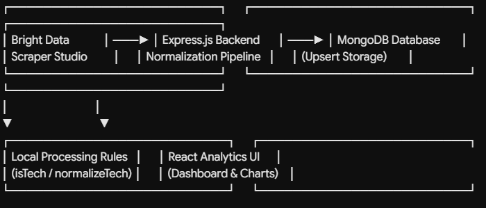

# DevPulse 🚀

> **AI-Powered Career Intelligence & Real-Time Tech Job Market Analytics**  
> *Built solo for the WeMakeDevs "Into the Scrape-Verse" Hackathon sponsored by Bright Data.*

DevPulse is a real-time developer job market analytics engine and career intelligence dashboard. By pairing **Bright Data Scraper Studio** for live web extraction with a deterministic local data-processing pipeline, DevPulse aggregates unlisted and active developer job opportunities, standardizes chaotic tech stack tags, filters out non-technical noise, and delivers actionable career insights.

---

## 📌 1. Project Overview & Inspiration

### Summary & Core Idea
DevPulse automatically aggregates, cleans, normalizes, and visualizes developer job opportunities directly from web career portals and tech boards. Instead of relying on static database dumps, DevPulse functions as a live data ingestion and insight pipeline that processes raw web data in real time, serving job seekers with dynamic demand metrics and standardized skill distributions.

### Why I Selected This Idea
Traditional hiring boards are flooded with messy, unstandardized postings where identical skills are labeled inconsistently (e.g., `React.js`, `ReactJS`, `react.js`, or `k8s` vs `Kubernetes`), and search results are often clogged with non-technical roles like sales or administrative positions. I built DevPulse to bridge the gap between raw web extraction and structured career intelligence—providing developers with clean, noise-free, and real-time market data.

---

## 💡 2. How DevPulse Differs from LinkedIn, Naukri, and Unstop

Unlike legacy job aggregators that rely on manually submitted, paid employer postings and simple keyword searches, DevPulse transforms job discovery into an automated, real-time data-engineering pipeline.

| Key Feature | Legacy Platforms (LinkedIn, Naukri, Unstop) | DevPulse |
| :--- | :--- | :--- |
| **Data Source** | Paid employer submissions & static listings | Live, automated web extraction via Bright Data Scraper Studio |
| **Data Cleanliness** | Unfiltered listings; contains non-tech roles & duplicates | Automated backend role validation (`isTechnicalJob`) & deduplication |
| **Skill Standardization** | Inconsistent tag variants (`react.js`, `ReactJS`) | Deterministic canonical normalization (`normalizeTechStack`) |
| **User Experience** | Static search pages & sponsored ads | Real-time analytics dashboard with skill demand charts & metrics |
| **Pipeline Reliability** | Breaks or returns errors when job sites update | Self-healing extraction via Bright Data's `bdata scraper heal` |

### Unique Benefits & Advantages
* **Zero Noise:** Non-developer roles (*e.g., Facilities Planner, Sales Representative*) are automatically detected and dropped by the backend before reaching the UI.
* **Standardized Skill Breakdown:** Skills are mapped to unified canonical names so developers can see true market demand (*e.g., React, Python, AWS, SQL*).
* **Idempotent Data Integrity:** Duplicate jobs across repeated scrape cycles are updated in place using MongoDB upserts rather than duplicating entries.

---

## ⚙️ 3. Architecture & Component Breakdown

DevPulse operates as an end-to-end data ingestion, normalization, and visual analytics pipeline.




### Component Details

#### 1. Bright Data Extraction Engine (Scraper Studio)
The ingestion layer utilizes custom web scrapers designed in **Bright Data Scraper Studio** (`c_*` Collector API endpoint). Triggered directly from the frontend UI or backend schedule, it extracts live job titles, descriptions, company names, remote statuses, and raw technology tags from public career web pages.

#### 2. Deterministic Local Processing Engine (`isTechnicalJob` & `normalizeTechStack`)
When raw JSON payloads hit the Node.js backend, they pass through a dual-stage local processing service:
* **Role Filtering (`isTechnicalJob`):** Evaluates titles against developer patterns to discard non-technical positions.
* **Tag Normalization (`normalizeTechStack`):** Strips messy syntax and maps variations like `reactjs`, `react.js`, or `k8s` into unified tags (`React`, `Kubernetes`).

#### 3. Persistent MongoDB Storage (Upserts)
Cleaned jobs are stored in MongoDB. Using unique job identifiers, the database performs **upserts**—updating existing records if re-scraped, ensuring zero duplicates and accurate skill frequency counts.

#### 4. Responsive React Analytics Dashboard & Interactive Views
The React frontend (`http://localhost:5173`) renders real-time market metrics:
* **Metric Stat Cards:** Displays total active jobs, unique technology skills identified, remote job ratios, and top-demanded technologies.
* **Top Skill Demand Chart:** An interactive Bar Chart (via Recharts) displaying real-time skill distribution across all indexed listings.
* **Search & Live Opportunities Table:** A filterable, searchable job list with pagination and horizontal touch-scrolling for mobile viewports.

---

## 🚀 4. Scale & Scope

### Current Scope (MVP)
* **Real-time Web Scraping:** Live triggering via Bright Data Scraper Studio integration.
* **Backend Normalization:** Automated role validation, tag cleaning, and MongoDB upsert storage.
* **Responsive Analytics UI:** Fully responsive dashboard optimized for Mobile, Tablet, and Desktop screens.

### Scaling Roadmap
* **Automated Cron Scheduling:** Integrating `node-cron` for automated daily/weekly background extraction runs.
* **Personalized Candidate Fit Scoring:** Allowing users to upload resumes to score their skill match directly against normalized job requirements.
* **Regional Market Trends:** Expanding analytics to plot salary trends and technology demand by geographical region.

---

## 🛠️ 5. Installation & Setup Instructions

### Prerequisites
* **Node.js** (v18.0.0 or higher)
* **MongoDB** running locally (`mongodb://localhost:27017`)
* **Bright Data Account** (API Key & Collector ID)

### Environment Variables
Create a `.env` file in the `backend/` directory:

```env
PORT=5000
MONGO_URI=mongodb://localhost:27017/devpulse
BRIGHT_DATA_API_KEY=your_bright_data_api_key
BRIGHT_DATA_COLLECTOR_ID=c_xxxxxx
```


## 🌐 Live Deployment & Links

The project is hosted and accessible via the following production URLs:

| Service | Platform | Live URL |
| :--- | :--- | :--- |
| **Frontend UI** | Vercel | [https://devpulsefrontend.vercel.app/](https://devpulsefrontend.vercel.app/) |
| **Backend API** | Render | [https://devpulse-backend-afzc.onrender.com/](https://devpulse-backend-afzc.onrender.com/) |

---


## 🎥 Project Demo Video

[▶ Watch Demo Video](./demo.mp4)