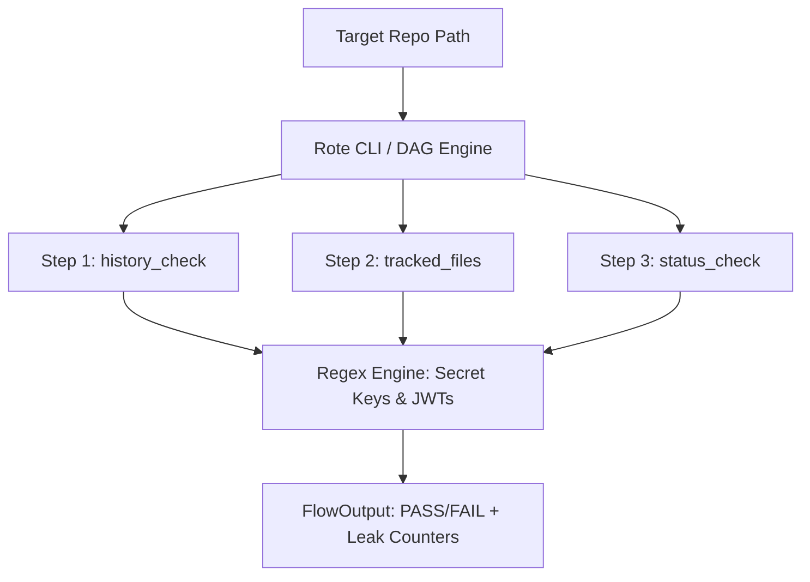

# Repo Leak Doctor (`praveen-sec/repo-leak-doctor@1.0.2`)

> **Zero-credential, local-only Git history and secret auditor for pre-push verification.**

---

## 🛡️ 1. Project Title & Executive Summary

- **Title:** Repo Leak Doctor (`praveen-sec/repo-leak-doctor@1.0.2`)
- **Summary:** **Repo Leak Doctor** is a zero-credential, local-only Git history and sensitive secret auditor built using the **Rote CLI** and TypeScript (`createPlay` DAG engine). It operates as a pre-push verification tool designed to run completely offline, without exposing API keys, source code, or credentials to third-party cloud services or external servers.

---

## 🎯 2. Project Vision, Target Audience & Impact

- **Why Selected:** Addressed the growing industry hazard of accidental credential exposure in public and private repositories (e.g., AWS access keys, JWTs, `.env` files, SSH keys).
- **Target Audience:** Open-source maintainers, software engineering teams, security researchers, and developers pushing code daily.
- **Helpfulness & Impact:** Provides instant feedback directly in the developer terminal or automated cron workflows, stopping secrets from ever reaching remote Git registries.

---

## 🏗️ 3. Comprehensive Project Architecture & Components

### Detailed Explanation
Repo Leak Doctor isolates audit checks into modular, parallelizable DAG steps (`history_check`, `tracked_files`, and `status_check`), followed by a presentation plane step that formats and structures findings.

### Architectural Workflow

1. **Input Parameter Ingestion:** Receives parameters like `target_dir` (path to repository) and `history_depth` (number of commits to scan, default 30).
2. **Local Git Tree Parsing:** Executes native Git processes:
   - `git log -p -n$history_depth` for commit diff history.
   - `git ls-files` for tracked files in the index.
   - `git status --porcelain` for uncommitted working directory changes.
3. **Pattern-Matching Regex Engine:** Scans stdout streams against regex rules identifying JWTs, AWS access key IDs, Bearer tokens, GitHub tokens (`ghp_`), and sensitive file extensions (`.env`, `.pem`, `.key`, `id_rsa`, `.aws/credentials`).
4. **Aggregate Result Formulation:** Emits structured output using `FlowOutput` (`PASS`/`FAIL` status along with `Tracked leaks` and `Uncommitted leaks` counters).

### Visual Architecture Representation



---

## 🛠️ 4. Competition Requirements & Platform Tools Used

- **Rote CLI & Modiqo Registry:** Used as the primary distribution, packaging, and execution engine (`praveen-sec/repo-leak-doctor@1.0.2`).
- **TypeScript (`__ROTE_PRESENTATION_SDK__`):** Used to build explicit, DAG-structured step execution (`createPlay`).
- **WSL (Windows Subsystem for Linux):** Used for developing, testing, and hosting continuous background monitoring via `crontab`.
- **Git Native Tooling:** Used for zero-dependency, local file scanning without third-party external services.

---

## ⚖️ 5. Competitive Analysis

| Feature | Repo Leak Doctor | Traditional Cloud Auditors | Standard Pre-Commit Hooks |
| :--- | :--- | :--- | :--- |
| **Credential Safety** | **100% Zero-Credential / Local** | Requires Cloud Sync / API Tokens | Local-only |
| **Execution Speed** | **Ultra-Fast Local DAG Steps** | Slow Network Overhead | Variable / Environment Dependent |
| **Registry & Automation** | **Public Modiqo Registry + Cron Ready** | Proprietary Platforms | Manual Setup per Repo |
| **Data Privacy** | **Code/Secrets Never Leave Disk** | Scanned on External Servers | Code Stays Local |

---

## 💻 6. Tech Stack

- **Framework & SDK:** Rote CLI, `__ROTE_PRESENTATION_SDK__`
- **Language:** TypeScript / Node.js (Deno runtime)
- **OS & Environment:** Linux / WSL2 (Ubuntu), PowerShell compatible
- **VCS & Automation:** Git, Linux Crontab

---

## 🎥 7. Demonstration Video

- **Watch the Demo:** [Watch the video](https://drive.google.com/file/d/10XrBorRz3IsQoY5_0eGUzfEE2j3VV_K5/view?usp=sharing)

---

## 🚀 8. Installation, Execution & Remediation Commands

### 1. Direct Terminal Execution (WSL / PowerShell)

Run the play directly against any target repository:

```bash
rote play run praveen-sec/repo-leak-doctor@1.0.2 target_dir=/path/to/your/repo -y
```

### 2. One-Line Bootstrap Web Installer

Install and run directly via the Modiqo Registry installer:

```bash
curl -fsSL https://play.modiqo.ai/install?play=praveen-sec/repo-leak-doctor@1.0.2 | sh
```

### 3. Remediation Commands (Fix Leaks Without Losing Local Files)

If secrets or sensitive files are flagged, follow this workflow to resolve them safely without deleting local developer files:

```bash
# Navigate to the affected repository
cd /path/to/target/repo

# Step A: Identify tracked sensitive files
git ls-files | grep -E '(\.env|\.pem|\.key|id_rsa|\.aws/credentials)'

# Step B: Untrack files from Git (retains local files on disk)
git rm --cached .env

# Step C: Update ignore rules
echo ".env" >> .gitignore

# Step D: Save security updates
git add .gitignore
git commit -m "security: untrack sensitive files and update ignore rules"

# Step E: Re-audit
rote play run praveen-sec/repo-leak-doctor@1.0.2 target_dir=. -y
```

---

## 🌟 9. Key Advantages & Benefits

* **Zero Data Leakage:** Runs entirely offline; code and credentials never leave disk.
* **Instant Developer Feedback:** Displays clear `Tracked leaks` and `Uncommitted leaks` counters.
* **Zero Credential Setup:** Requires no third-party API keys or accounts to execute.
* **Reusable Automation:** Easy to plug into local repositories or background hourly crontab jobs.

---

## 📈 10. Scope & Future Scalability

- **Current Scope:** Local pre-push secret and file auditing across custom directory paths.
- **Future Scale:** Expanding regex rule sets for custom team secrets, enterprise configuration profiles, and automated IDE extension integrations.

---

## 🔗 11. Official Links

- **Public Package Listing:** [Repo Leak Doctor Registry Listing](https://play.modiqo.ai/praveen-sec/repo-leak-doctor@1.0.2)
- **One-Line Installer Endpoint:** [Repo Leak Doctor Bootstrap Endpoint](https://play.modiqo.ai/install?play=praveen-sec/repo-leak-doctor@1.0.2)

---

## 📄 12. License

- Published under the **MIT License**.
